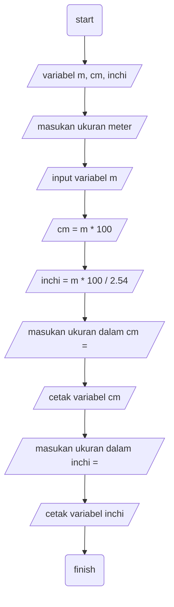

```mermaid
   flowchart TD;
   A(start) --> B[/variabel m, cm, inchi/];
   B --> C[/masukan ukuran meter/];
   C --> D[/input variabel m/];
   D --> E[/cm = m * 100/];
   E --> F[/inchi = m * 100 / 2.54/];
   F --> G[/masukan ukuran dalam cm =/];
   G --> H[/cetak variabel cm/];
   H --> I[/masukan ukuran dalam inchi =/];
   I --> J[/cetak variabel inchi/];
   J --> K(finish);
```